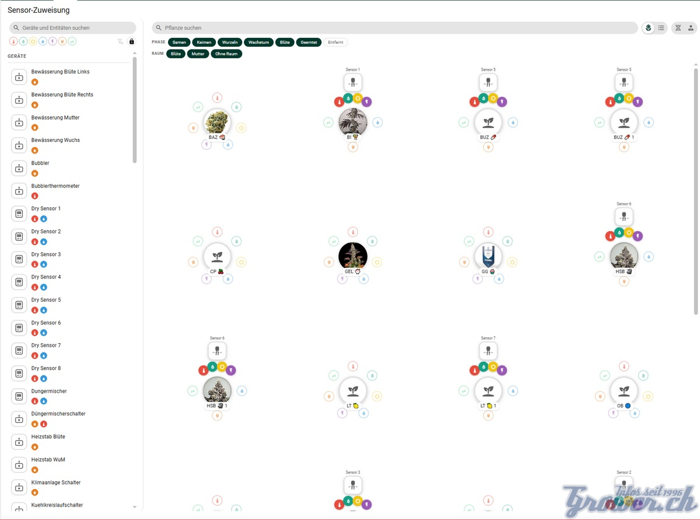
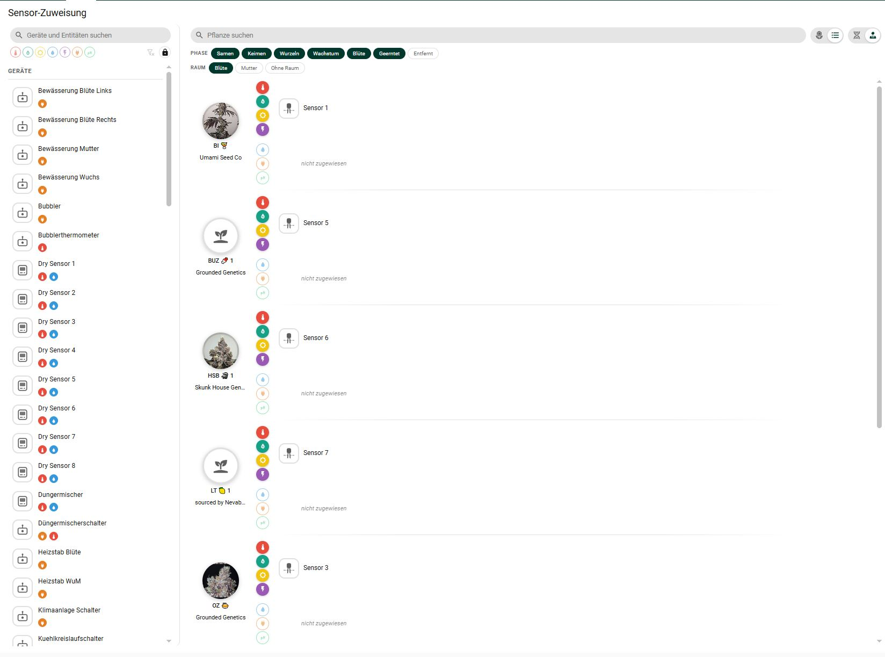

# Brokkoli Card for Home Assistant

**Lovelace cards for cannabis visualization - Part of the Brokkoli Suite**

Lovelace cards for monitoring cannabis plants in Home Assistant. Requires the Brokkoli Cannabis Management integration for plant visualization and management.

## 🌱 Features

### Four Specialized Card Types
- **Individual Plant Cards**: Detailed monitoring with sensors, timelines, and consumption tracking
- **Area Cards**: Interactive spatial plant arrangement with drag & drop positioning
- **List Cards**: Tabular overview with sorting, filtering, and bulk operations
- **Sensor Assignment Cards**: Drag & drop assignment of sensors to plants

### Visualization Features
- **Sensor Bars**: Display of moisture, temperature, light, conductivity, pH, humidity, and health
- **Interactive Elements**: Expandable sections for timeline, consumption, history, and detailed information
- **Heatmaps**: Visual representation of sensor data across plant areas
- **Colored Rings**: Status indicators around plants in area view

### Management Features
- **Drag & Drop**: Plant positioning in area cards
- **Multi-selection**: Bulk operations on multiple plants
- **Cross-card Communication**: Synchronized selection across different card types
- **Filtering & Search**: Plant discovery and organization

## 🔧 Installation

### Prerequisites
This card requires the **[Brokkoli Cannabis Management](https://github.com/dingausmwald/homeassistant-brokkoli)** integration to function properly.

### HACS Installation (Recommended)

[](https://github.com/hacs/integration)

1. Add this repository as a [Custom Repository](https://hacs.xyz/docs/faq/custom_repositories/) in HACS
2. Set the category to "Lovelace"
3. Click "Install" on the "Brokkoli Card" card
4. **Important**: Manually add dashboard resources for list and area cards:
   - Go to **Settings** → **Dashboards** → **Resources**
   - Add `/hacsfiles/lovelace-brokkoli-card/brokkoli-list-card.js` as JavaScript Module
   - Add `/hacsfiles/lovelace-brokkoli-card/brokkoli-area-card.js` as JavaScript Module
5. Refresh your browser (Shift+Reload recommended)

### Manual Installation

1. Download `brokkoli-card.js`, `brokkoli-area-card.js`, and `brokkoli-list-card.js`
2. Place files in your `<config>/www/` directory
3. Add resources in **Settings** → **Dashboards** → **Resources**:
   ```yaml
   Url: /local/<path-to>/brokkoli-card.js
   Resource type: JavaScript Module
   ```
4. Repeat for all three card files
5. Refresh your browser

## 🚀 Quick Start

### 1. Set up your first plant card
1. Edit your dashboard and add a new card
2. Search for "Brokkoli Card" in the card picker
3. Select your cannabis plant entity
4. Customize display options and sensor bars

### 2. Create an area overview
1. Add a "Brokkoli Area Card" to your dashboard
2. Configure it to show plants from a specific area
3. Use drag & drop to position plants visually
4. Enable heatmaps for sensor visualization

### 3. Build a plant management dashboard
1. Add a "Brokkoli List Card" for tabular overview
2. Enable multi-selection and filtering
3. Configure cross-card communication with identifiers

### 4. Wire up your sensors
1. Add a "Brokkoli Sensor Assignment Card" to your dashboard
2. Drag a device from the left column onto a plant
3. Click a single type chip to assign only that sensor

## 📊 Card Types

### Brokkoli Card
Individual plant monitoring with sensor information and interactive elements.


   

#### Configuration Options
```yaml
type: custom:brokkoli-card
entity: plant.my_plant            # Required: The plant entity
battery_sensor: sensor.demo_battery   # Optional: Battery sensor

# Sensor bars to display
show_bars:
  - moisture
  - temperature
  - conductivity
  - brightness
  - humidity
  - dli
  - fertility
  - health

# Full-width bars
full_width_bars:
  - health

# Elements to show on card
show_elements:
  - header
  - attributes
  - options
  - timeline
  - consumption

# Options menu elements
option_elements:
  - attributes
  - timeline
  - consumption
  - history
  - details

# Default expanded options
default_expanded_options:
  - timeline
  - history

# Display type: "full" or "compact"
display_type: full

# Cross-card communication
listen_to: my_identifier

# History grouping
history_groups:
  - moisture
  - temperature
  - conductivity

# History line position: "left" or "right"
history_line_position: left
```

### Brokkoli Area Card
Spatial plant arrangement with visual sensor indicators.


#### Configuration Options
```yaml
type: custom:brokkoli-area-card
title: My Plant Area

# Plant selection (choose one)
area: living_room                 # Show plants from area
entity: plant.my_plant           # Single plant
entities:                        # Multiple plants
  - plant.plant1
  - plant.plant2

# Cross-card communication
identifier: my_area

# Sensor rings around plants
show_rings:
  - health
  - moisture
  - temperature
  - brightness

# Center labels
show_labels:
  - moisture
  - temperature

# Heatmap configuration
heatmap: moisture
heatmap_color: "#00ff00"
heatmap_secondary_color: "white"
heatmap_opacity: 0.8

# Show legend
legend: true
```

### Brokkoli List Card
Tabular overview with filtering and bulk operations.


#### Configuration Options
```yaml
type: custom:brokkoli-list-card
title: Plant Overview
area: living_room              # Filter by area

# Cross-card communication
identifier: my_list

# Search configuration
search:
  enabled: true
  placeholder: Search for plants...

# Multi-selection
multiselect:
  enabled: true
  showbydefault: false

# Filtering
filter:
  enabled: true
  showbydefault: false
  filters:
    entity_type: ['plant', 'cycle']
    area: ['living_room', 'kitchen']
    moisture:
      min: 20
      max: 80
    temperature:
      min: 18
      max: 28

# Add plant button
add_plant:
  enabled: true
  position: bottom

# Column visibility
show_columns:
  friendly_name: true
  state: true
  area: true
  moisture: true
  temperature: true
  brightness: false
  conductivity: false
  fertility: false
  humidity: false
  ph: false
  health: true
  battery: false
  growth_phase: false
  pot_size: false
  images: false
  notes: false
  cycle: false
  variant: false
```

### Brokkoli Sensor Assignment Card
Drag & drop assignment of sensors to plants, in two views.





Sources are listed on the left, one row per device or loose entity, with a coloured chip for every sensor type it offers. On the right each plant is either a flower — the plant in the centre, its assigned sources on an orbit, the type icons sitting on the stems — or a row in a list. Drag a source onto a plant to assign it, drag a leaf to another plant to move it, drag it back into the left column to release it. Clicking a single type chip picks just that sensor; the selection survives across sources and is dragged as a whole. Types already taken are skipped rather than overwritten unless the lock button is switched on.

#### Configuration Options
```yaml
type: custom:brokkoli-sensor-assignment-card
title: Sensor assignment       # Optional: card header

# Starting view of the plant column: "flower" or "list".
# The toggle in the card overrides this for the session only.
view: flower

# Visible growth phases. Omitted or empty = everything except "removed";
# harvested plants stay visible on purpose, drying still needs sensors.
plant_phases:
  - growing
  - flowering
  - harvested

# Visible rooms by area_id. Omitted or empty = every room that holds plants,
# so rooms added later show up by themselves.
plant_areas:
  - blute
  - wuchs

# Any CSS length or a bare number for pixels. Only needed where the view does
# not give the card a height of its own (masonry). In sections views the
# configured row count wins, in panel views the card fills the screen.
height: 600px
```

## 🎨 Brokkoli Suite Integration

The Brokkoli Card is part of the Brokkoli Suite for cannabis cultivation:

### [Brokkoli Cannabis Management](https://github.com/dingausmwald/homeassistant-brokkoli)
- Core integration for cannabis plant monitoring
- Device-based plant management with sensors
- Configurable thresholds and problem detection
- Cycle system for plant grouping
- Comprehensive service API

### [Seedfinder Integration](https://github.com/dingausmwald/homeassistant-seedfinder)
- Cannabis strain database access
- Strain data and imagery
- Growth phase definitions
- Cultivation information

## 🔗 Cross-Card Communication

Enable interaction between different card types:

1. **Set up communication identifiers**:
   ```yaml
   # In Area or List Card
   identifier: my_plants
   
   # In Individual Plant Card
   listen_to: my_plants
   ```

2. **Benefits**:
   - Selecting a plant in Area/List Card updates the Individual Plant Card
   - Synchronized plant selection across dashboard
   - Coordinated multi-card layouts

## 🎛️ Configuration Details

### Available Elements
- `header` - Plant image and basic information
- `attributes` - Sensor bars and readings
- `options` - Interactive options menu
- `timeline` - Historical data visualization
- `consumption` - Power and resource tracking
- `history` - Detailed sensor history
- `details` - Comprehensive plant information

### Sensor Bar Types
- **Moisture**: Soil moisture percentage
- **Temperature**: Ambient temperature
- **Brightness/Light**: Light intensity (lux)
- **Conductivity**: Soil conductivity (µS/cm)
- **pH**: Soil pH level
- **Humidity**: Air humidity percentage
- **DLI**: Daily Light Integral
- **Fertility**: Nutrient levels
- **Health**: Overall plant health status

## 🆘 Troubleshooting

### Cards Not Loading
- Ensure all JavaScript modules are properly added to Dashboard Resources
- Clear browser cache with Shift+Reload
- Verify Brokkoli Cannabis Management integration is installed and configured

### Cross-Card Communication Not Working
- Check that identifiers match exactly between cards
- Ensure cards are on the same dashboard
- Verify plant entities exist and are accessible

### Performance Issues
- Reduce the number of visible sensor bars
- Limit history data range
- Consider using compact display mode for multiple cards

## 🤝 Contributing

Contributions are welcome! Please feel free to submit pull requests, report issues, or suggest improvements.

## 📄 License

This project is licensed under the MIT License.

## ☕ Support

If you find this project helpful, consider supporting its development:

<a href="https://buymeacoffee.com/dingausmwald" target="_blank">

</a>

---

**Part of the Brokkoli Suite** - Cannabis cultivation tracking for Home Assistant
